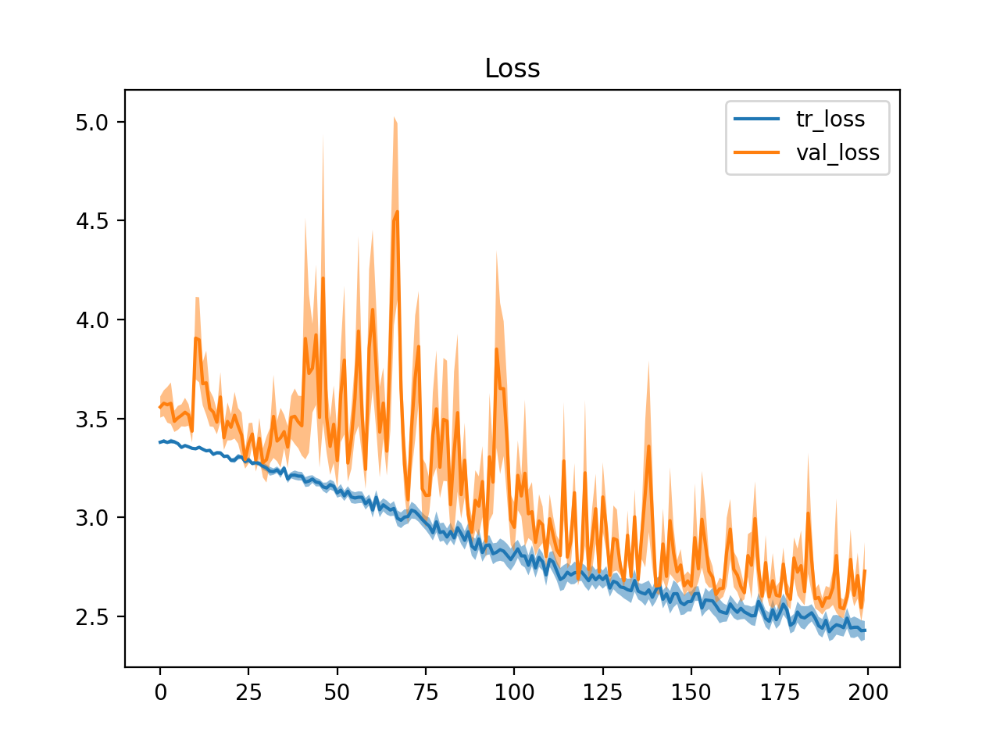
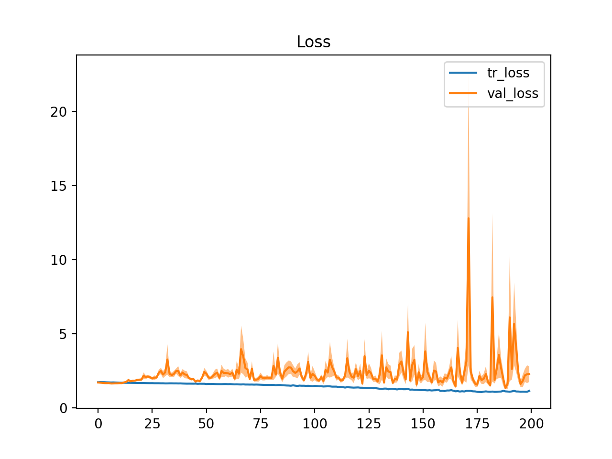
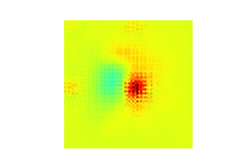

# Project 1: Classification and visualisation of chemotherapy induced cognitive impairment in Volumetric Convolutional Neural Network     

Chemotherapy induced cognitive impairment is the common side effect for cancer survivors who undergone chemotherapy.  
In this project, I tried to differenciate the CICI from healthy participants. This project is published in [here](https://www.mdpi.com/2075-4426/11/10/1025).

### Phase 1: Check the image data

Due to some privacy ussue, this part cannot be shown here.

### Phase 2: Data_Cleaning, Data_preprocessing

> #### Data_Cleaning
<ol>
  <li> Remove the subjects who are too young to cancer survivors </li>
  <li> Remove the subjects who been diagnosed with mentally disorders </li>
  <li> Remove the subjects whose images with strong artefacts </li>  
</ol>

> #### Data_preprocessing
<ol>
  <li> Obtain features from fMRI data and diffusional MRI images </li>
  <li> Features in fMRI: mfALFF, mReHo </li>
  <li> Features in diffusional MRI: FA, AD, MD  </li> 
  <li> The above features were re-scaled to range [0, 1]  </li> 
</ol>

### Phase 3: Construct 2 Volumetric CNN model using Tensorflow

> #### The CNN model I picked
<ol> 
  <li> SE-ResNet-50 </li>
  <li> DenseNet-121 </li>
</ol>

To simplify the training procedure, I used mfALFF as input feature only  
All the traing procedures followed the rule of 10-fold cross validation

Fig 1. The learning curve of SE-ResNet-50  

Fig 2. The learning curve of DenseNet-121   

### Phase 4: Evaluate the model
Table 1. Model performance

Models/ Performance| Avg training accuracy| Avg validate accuracy
--- |---|---
SE-ResNet-50 (mean ± SD) |0.96 (0.03)|0.92 (0.04)
DenseNet- 121 (mean ± SD)  | 0.93 (0.05) | 0.89 (0.05)

Table 2. Model performance with test data

Models/ Performance| Accuracy|Precision|Recall|AUC| F1-score
--- |---|---|---|---|---
SE-ResNet-50 (mean ± SD) |0.8 (0.07)|0.78 (0.13) |0.7 (0.18) |0.72 (0.09) |0.73 (0.1)
DenseNet- 121 (mean ± SD)  | 0.8 (0.04) |0.86 (0.12) |0.8 (0.13) | 0.87 (0.06)| 0.81 (0.05)

Fig 3. The most important regions for CICI classification  

