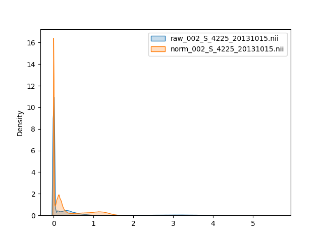

# Graduate-Pjt
The summary to the work I have done in graduate school

## Project 1: Classification and visualisation of chemotherapy induced cognitive impairment in Volumetric Convolutional Neural Network     

Chemotherapy induced cognitive impairment is the common side effect for cancer survivors who undergone chemotherapy.  
In this project, I tried to differenciate the CICI from healthy participants.

### Phase 1: Check the image data

Due to some privacy ussue, this part cannot be shown here.

### Phase 2: Data_Cleaning, Data_preprocessing

> #### Data_Cleaning
<ol>
  <li> Remove the subjects who are too young to cancer survivors </li>
  <li> Remove the subjects who been diagnosed with mentally disorders </li>
  <li> Remove the subjects whose images with strong artefacts </li>  
</ol>

> #### Data_preprocessing
<ol>
  <li> Obtain features from fMRI data and diffusional MRI images </li>
  <li> Features in fMRI: mfALFF, mReHo </li>
  <li> Features in diffusional MRI: FA, AD, MD  </li> 
  <li> The above features were re-scaled to range [0, 1]  </li> 
</ol>

### Phase 3: Construct 2 Volumetric CNN model using Tensorflow

#### The CNN model I picked
<ol> 
  <li> SE-ResNet-50 </li>
  <li> DenseNet-121 </li>
</ol>

To simplify the training procedure, I used mfALFF as input feature only  
All the traing procedures followed the rule of 10-fold cross validation

Fig 1. The learning curve of SE-ResNet-50  

Fig 2. The learning curve of DenseNet-121   

### Phase 4: Evaluate the model
Table 1. Model performance

Models/ Performance| Avg training accuracy| Avg validate accuracy
--- |---|---
SE-ResNet-50 (mean ± SD) |0.96 (0.03)|0.92 (0.04)
DenseNet- 121 (mean ± SD)  | 0.93 (0.05) | 0.89 (0.05)

Table 2. Model performance with test data

Models/ Performance| Accuracy|Precision|Recall|AUC| F1-score
--- |---|---|---|---|---
SE-ResNet-50 (mean ± SD) |0.8 (0.07)|0.78 (0.13) |0.7 (0.18) |0.72 (0.09) |0.73 (0.1)
DenseNet- 121 (mean ± SD)  | 0.8 (0.04) |0.86 (0.12) |0.8 (0.13) | 0.87 (0.06)| 0.81 (0.05)

Fig 3. The most important regions for CICI classification  

## Project 2: One step image registration for Positron Emission Tomography (PET) image using GAN

In this project, I used general advasarial network (GAN) to simplify the PET and MRI image coregistration
 
All the image data used in this project are from [ADNI dataset](http://adni.loni.usc.edu), in this study I used 100 Raw PET 3D Neuro Dynamic images and their coresponding Co-Registered Processed PET images.

### Phase 1: Check the data

Fig 1. The data distribution of raw images  

I know that the range for each image are different.

### Phase 2: Data_Cleaning, Data_preprocessing

From Phase 1, I know the data is complicated. 
To simplify the data, I selected the data with identical distribution and the image size less than (128, 128, 128)  
Then standardised Raw PET 3D Neuro Dynamic images based on the preproceesing steps that listed on ADNI website. 

Here's the results of the pre-processed data

Fig 2. The data distribution of preprocessed raw data and target data  

### Phase 3: Construct a pix2pix model using Tensorflow

The original paper of pix2pix can be seen at [here](https://arxiv.org/abs/1611.07004) 
In my project, I modified the generator into a self-constructed volumetric [U-Net](https://arxiv.org/abs/1505.04597) 
The discriminator is another self-constructed volumetric Convolutional Neural Network (CNN)

The overall architectures of generators and discriminators can be seen at [here](./Project_oneStepNorm/Data_distribution/Report/)

Fig 3. The learning curve of pix2pix model  

### Phase 4: Evaluate the model
Finally, here's the comparison between the predicted image and the target normalised image

Fig. Results  

